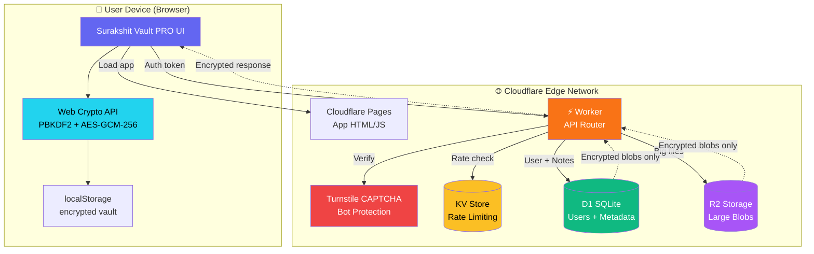
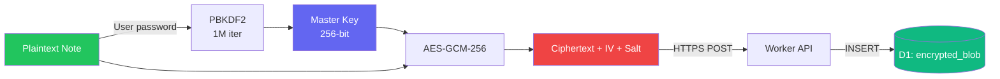
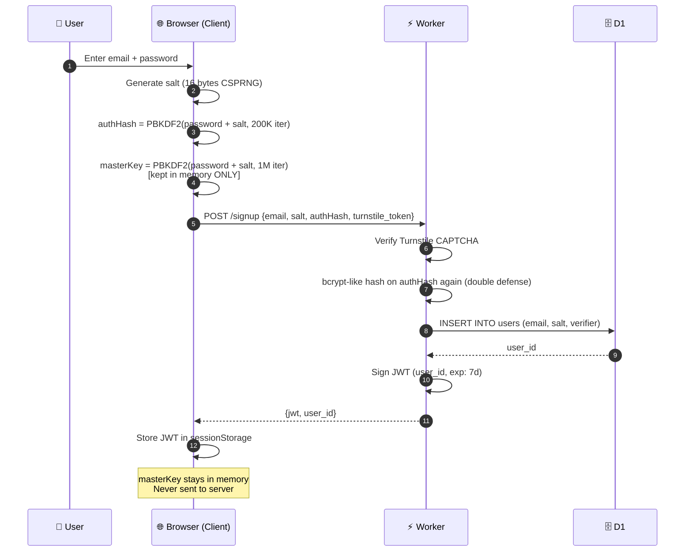
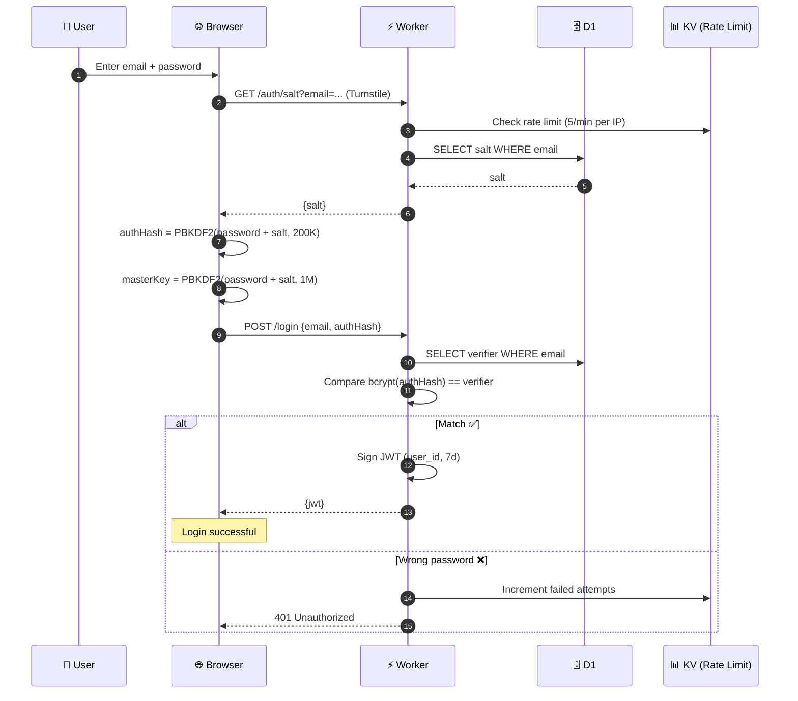
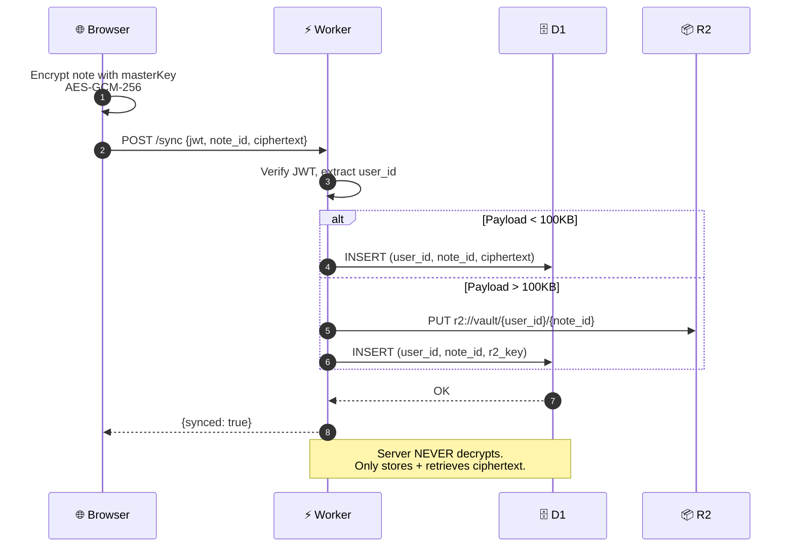
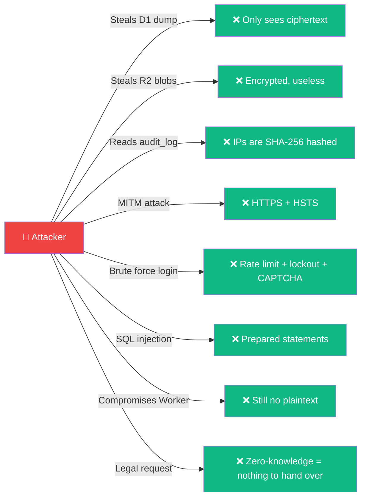

# ☁️ Surakshit Vault PRO — Cloudflare Backend Guide (Production Grade)

> **Optional backend.** App 100% offline chalega without any backend.  
> Yeh guide un logon ke liye hai jo apna khud ka encrypted multi-user sync backend deploy karna chahte hain.

**Stack:** Cloudflare Workers + D1 (SQLite) + R2 (Blob) + KV (Rate Limit) + Turnstile (CAPTCHA)  
**Security Model:** Zero-Knowledge, Server sees only ciphertext + auth verifier hash  
**Cost:** ₹0 for typical use (Cloudflare free tier: 100K reqs/day, 5GB D1, 10GB R2)

---

## 📑 Contents

- [🎯 Core Principles](#-core-principles)
- [🏗️ Architecture Diagram](#️-architecture-diagram)
- [🔐 Zero-Knowledge Auth Flow](#-zero-knowledge-auth-flow)
- [📊 Database Schema (D1 SQLite)](#-database-schema-d1-sqlite)
- [🚀 Deployment (Step-by-Step)](#-deployment-step-by-step)
- [💻 Worker Code](#-worker-code-full-implementation)
- [🔗 App Se Connect Karna](#-app-se-connect-karna)
- [🛡️ Security Hardening](#️-security-hardening)
- [🕵️ Threat Model](#️-threat-model-attacker-cannot)
- [❓ FAQ](#-faq)

---

## 🎯 Core Principles

| Principle | How |
|---|---|
| **Zero-Knowledge** | Password kabhi server par nahi jata. Sirf `verifier hash` jata hai. |
| **Client-Side Encryption** | Data browser mein AES-GCM-256 se encrypt hota hai. Server sirf ciphertext dekhta hai. |
| **Multi-User Isolation** | Har user ka apna `user_id` aur alag encrypted vault. |
| **No PostgreSQL** | Sirf D1 (SQLite) — serverless, edge-native, ultra-fast. |
| **Env Variables Only** | Saare secrets `wrangler secret` mein. Code mein kabhi nahi. |
| **Optional** | App backend ke bina bhi chalta hai. |

---

## 🏗️ Architecture Diagram

### Overall System



### Data Flow (Encryption)



---

## 🔐 Zero-Knowledge Auth Flow

### Signup Sequence



### Login Sequence



### Data Sync Sequence



---

## 📊 Database Schema (D1 SQLite)

```sql
-- users table (auth)
CREATE TABLE users (
  id           TEXT PRIMARY KEY,          -- UUID v4
  email        TEXT UNIQUE NOT NULL,      -- lowercased
  salt         TEXT NOT NULL,             -- base64 16-byte CSPRNG salt (public)
  verifier     TEXT NOT NULL,             -- bcrypt(PBKDF2(pw+salt)) — password verifier
  created_at   INTEGER NOT NULL,          -- unix timestamp
  last_login   INTEGER,
  failed_count INTEGER DEFAULT 0,         -- lockout counter
  locked_until INTEGER                    -- lockout timestamp
);

CREATE INDEX idx_users_email ON users(email);

-- vaults table (encrypted notes)
CREATE TABLE vaults (
  id           TEXT PRIMARY KEY,          -- UUID v4
  user_id      TEXT NOT NULL,             -- FK -> users.id
  title_hash   TEXT,                      -- SHA-256 of title (for search, optional)
  ciphertext   TEXT,                      -- base64 AES-GCM payload (if small)
  r2_key       TEXT,                      -- R2 object key (if payload > 100KB)
  size_bytes   INTEGER NOT NULL,
  created_at   INTEGER NOT NULL,
  updated_at   INTEGER NOT NULL,
  FOREIGN KEY (user_id) REFERENCES users(id) ON DELETE CASCADE
);

CREATE INDEX idx_vaults_user ON vaults(user_id);
CREATE INDEX idx_vaults_updated ON vaults(user_id, updated_at DESC);

-- audit_log (privacy-safe, no data content logged)
CREATE TABLE audit_log (
  id           INTEGER PRIMARY KEY AUTOINCREMENT,
  user_id      TEXT,
  action       TEXT NOT NULL,             -- 'login', 'signup', 'sync', 'fetch', 'delete'
  ip_hash      TEXT,                      -- SHA-256(IP + salt) — cannot reverse
  ua_hash      TEXT,                      -- SHA-256(User-Agent + salt)
  created_at   INTEGER NOT NULL,
  success      INTEGER DEFAULT 1
);

-- sessions (JWT blacklist for logout)
CREATE TABLE revoked_tokens (
  jti          TEXT PRIMARY KEY,          -- JWT ID
  user_id      TEXT NOT NULL,
  revoked_at   INTEGER NOT NULL
);
```

---

## 🚀 Deployment (Step-by-Step)

### Prerequisites
- Cloudflare account (free)
- Node.js 20+
- `npm install -g wrangler` (Cloudflare CLI)

### 1️⃣ Login to Cloudflare
```bash
wrangler login
```

### 2️⃣ Create the Backend Project
```bash
mkdir surakshit-backend
cd surakshit-backend
npm init -y
npm install hono @tsndr/cloudflare-worker-jwt
npm install -D wrangler @cloudflare/workers-types typescript
```

### 3️⃣ Create D1 Database
```bash
wrangler d1 create surakshit-vault-db
# Copy the database_id from output
```

### 4️⃣ Create R2 Bucket
```bash
wrangler r2 bucket create surakshit-vault-blobs
```

### 5️⃣ Create KV Namespace
```bash
wrangler kv namespace create RATE_LIMIT
# Copy the id from output
```

### 6️⃣ Setup Turnstile (CAPTCHA)
- Go to https://dash.cloudflare.com → Turnstile → Add Site
- Copy **Site Key** (public) and **Secret Key** (private)

### 7️⃣ Configure `wrangler.toml`
```toml
name = "surakshit-backend"
main = "src/index.ts"
compatibility_date = "2025-01-01"

[[d1_databases]]
binding = "DB"
database_name = "surakshit-vault-db"
database_id = "PASTE_YOUR_ID_HERE"

[[r2_buckets]]
binding = "BLOBS"
bucket_name = "surakshit-vault-blobs"

[[kv_namespaces]]
binding = "RATE_LIMIT"
id = "PASTE_YOUR_KV_ID_HERE"

[vars]
TURNSTILE_SITE_KEY = "0x4AAAAA..." # public, safe to expose
CORS_ORIGIN = "https://surakshit-vault-pro.pages.dev"
```

### 8️⃣ Set Secrets (Environment Variables)
```bash
# JWT signing secret (generate a strong one!)
wrangler secret put JWT_SECRET
# Paste 64+ char random string

# Turnstile secret (private)
wrangler secret put TURNSTILE_SECRET
# Paste your turnstile secret

# IP hash salt (for privacy-safe audit logs)
wrangler secret put IP_HASH_SALT
# Paste another 32+ char random string
```

### 9️⃣ Initialize Database Schema
Save the schema (above) as `schema.sql`, then:
```bash
wrangler d1 execute surakshit-vault-db --file=./schema.sql
```

### 🔟 Deploy
```bash
wrangler deploy
```

Your API is now live at: `https://surakshit-backend.YOUR-SUBDOMAIN.workers.dev`

---

## 💻 Worker Code (Full Implementation)

### `src/index.ts`

```typescript
import { Hono } from "hono";
import { cors } from "hono/cors";
import * as jwt from "@tsndr/cloudflare-worker-jwt";

type Env = {
  DB: D1Database;
  BLOBS: R2Bucket;
  RATE_LIMIT: KVNamespace;
  JWT_SECRET: string;
  TURNSTILE_SECRET: string;
  TURNSTILE_SITE_KEY: string;
  IP_HASH_SALT: string;
  CORS_ORIGIN: string;
};

const app = new Hono<{ Bindings: Env }>();

// CORS
app.use("*", async (c, next) => {
  const origin = c.env.CORS_ORIGIN || "*";
  return cors({
    origin: [origin, "http://localhost:5173"],
    credentials: true,
    allowMethods: ["GET", "POST", "DELETE", "OPTIONS"],
    allowHeaders: ["Content-Type", "Authorization"],
  })(c, next);
});

// Security headers
app.use("*", async (c, next) => {
  await next();
  c.header("X-Content-Type-Options", "nosniff");
  c.header("X-Frame-Options", "DENY");
  c.header("Strict-Transport-Security", "max-age=31536000");
  c.header("Referrer-Policy", "no-referrer");
});

// Utilities
async function sha256(text: string): Promise<string> {
  const buf = new TextEncoder().encode(text);
  const hash = await crypto.subtle.digest("SHA-256", buf);
  return btoa(String.fromCharCode(...new Uint8Array(hash)));
}

async function verifyTurnstile(token: string, secret: string, ip: string): Promise<boolean> {
  const res = await fetch("https://challenges.cloudflare.com/turnstile/v0/siteverify", {
    method: "POST",
    headers: { "Content-Type": "application/json" },
    body: JSON.stringify({ secret, response: token, remoteip: ip }),
  });
  const data = await res.json() as { success: boolean };
  return data.success;
}

async function rateLimit(kv: KVNamespace, key: string, max: number, windowSec: number): Promise<boolean> {
  const raw = await kv.get(key);
  const count = raw ? parseInt(raw, 10) : 0;
  if (count >= max) return false;
  await kv.put(key, String(count + 1), { expirationTtl: windowSec });
  return true;
}

async function auditLog(env: Env, userId: string | null, action: string, ip: string, ua: string, success = true) {
  try {
    const ipHash = await sha256(ip + env.IP_HASH_SALT);
    const uaHash = await sha256(ua + env.IP_HASH_SALT);
    await env.DB.prepare(
      "INSERT INTO audit_log (user_id, action, ip_hash, ua_hash, created_at, success) VALUES (?, ?, ?, ?, ?, ?)"
    ).bind(userId, action, ipHash, uaHash, Date.now(), success ? 1 : 0).run();
  } catch {}
}

// JWT middleware
async function requireAuth(c: any, next: any) {
  const authHeader = c.req.header("Authorization");
  if (!authHeader?.startsWith("Bearer ")) {
    return c.json({ error: "Missing token" }, 401);
  }
  const token = authHeader.slice(7);
  const valid = await jwt.verify(token, c.env.JWT_SECRET);
  if (!valid) return c.json({ error: "Invalid token" }, 401);
  const payload = jwt.decode(token).payload as any;

  // Check revocation
  const revoked = await c.env.DB.prepare(
    "SELECT 1 FROM revoked_tokens WHERE jti = ?"
  ).bind(payload.jti).first();
  if (revoked) return c.json({ error: "Token revoked" }, 401);

  c.set("user_id", payload.sub);
  c.set("jti", payload.jti);
  await next();
}

// =============== ROUTES ===============

app.get("/", (c) => c.json({
  name: "Surakshit Vault PRO Backend",
  version: "1.0.0",
  turnstile_site_key: c.env.TURNSTILE_SITE_KEY
}));

// GET /auth/salt?email=... — returns salt for login (public)
app.get("/auth/salt", async (c) => {
  const email = c.req.query("email")?.toLowerCase().trim();
  if (!email) return c.json({ error: "Email required" }, 400);
  const ip = c.req.header("CF-Connecting-IP") || "0.0.0.0";
  const okRate = await rateLimit(c.env.RATE_LIMIT, `salt:${ip}`, 20, 60);
  if (!okRate) return c.json({ error: "Rate limit" }, 429);

  const user = await c.env.DB.prepare("SELECT salt FROM users WHERE email = ?")
    .bind(email).first();

  // Always return a salt (real or fake) to prevent email enumeration
  const salt = user?.salt || await sha256(email + c.env.IP_HASH_SALT).then(h => h.slice(0, 24));
  return c.json({ salt });
});

// POST /auth/signup — {email, salt, authHash, turnstile}
app.post("/auth/signup", async (c) => {
  const ip = c.req.header("CF-Connecting-IP") || "0.0.0.0";
  const ua = c.req.header("User-Agent") || "unknown";
  const okRate = await rateLimit(c.env.RATE_LIMIT, `signup:${ip}`, 3, 3600);
  if (!okRate) return c.json({ error: "Too many signups, try later" }, 429);

  const { email, salt, authHash, turnstile } = await c.req.json();
  if (!email || !salt || !authHash) return c.json({ error: "Missing fields" }, 400);

  // Turnstile
  const turnstileOk = await verifyTurnstile(turnstile, c.env.TURNSTILE_SECRET, ip);
  if (!turnstileOk) return c.json({ error: "CAPTCHA failed" }, 403);

  // Check existing
  const existing = await c.env.DB.prepare("SELECT id FROM users WHERE email = ?")
    .bind(email.toLowerCase()).first();
  if (existing) {
    await auditLog(c.env, null, "signup", ip, ua, false);
    return c.json({ error: "Email already registered" }, 409);
  }

  // Double-hash the client's authHash (defense in depth)
  const verifier = await sha256(authHash + c.env.JWT_SECRET);

  const userId = crypto.randomUUID();
  await c.env.DB.prepare(
    "INSERT INTO users (id, email, salt, verifier, created_at) VALUES (?, ?, ?, ?, ?)"
  ).bind(userId, email.toLowerCase(), salt, verifier, Date.now()).run();

  const jti = crypto.randomUUID();
  const token = await jwt.sign(
    { sub: userId, jti, iat: Math.floor(Date.now()/1000), exp: Math.floor(Date.now()/1000) + 7*24*3600 },
    c.env.JWT_SECRET
  );

  await auditLog(c.env, userId, "signup", ip, ua, true);
  return c.json({ jwt: token, user_id: userId });
});

// POST /auth/login — {email, authHash, turnstile}
app.post("/auth/login", async (c) => {
  const ip = c.req.header("CF-Connecting-IP") || "0.0.0.0";
  const ua = c.req.header("User-Agent") || "unknown";
  const okRate = await rateLimit(c.env.RATE_LIMIT, `login:${ip}`, 10, 300);
  if (!okRate) return c.json({ error: "Too many attempts, try later" }, 429);

  const { email, authHash, turnstile } = await c.req.json();
  if (!email || !authHash) return c.json({ error: "Missing fields" }, 400);

  const turnstileOk = await verifyTurnstile(turnstile, c.env.TURNSTILE_SECRET, ip);
  if (!turnstileOk) return c.json({ error: "CAPTCHA failed" }, 403);

  const user = await c.env.DB.prepare(
    "SELECT id, verifier, locked_until, failed_count FROM users WHERE email = ?"
  ).bind(email.toLowerCase()).first() as any;

  if (!user) {
    await auditLog(c.env, null, "login", ip, ua, false);
    return c.json({ error: "Invalid credentials" }, 401);
  }

  // Account lockout
  if (user.locked_until && user.locked_until > Date.now()) {
    return c.json({ error: "Account temporarily locked" }, 423);
  }

  const check = await sha256(authHash + c.env.JWT_SECRET);
  if (check !== user.verifier) {
    const newCount = (user.failed_count || 0) + 1;
    const lockUntil = newCount >= 5 ? Date.now() + 15*60*1000 : null;
    await c.env.DB.prepare(
      "UPDATE users SET failed_count = ?, locked_until = ? WHERE id = ?"
    ).bind(newCount, lockUntil, user.id).run();
    await auditLog(c.env, user.id, "login", ip, ua, false);
    return c.json({ error: "Invalid credentials" }, 401);
  }

  // Reset failed count
  await c.env.DB.prepare(
    "UPDATE users SET failed_count = 0, locked_until = NULL, last_login = ? WHERE id = ?"
  ).bind(Date.now(), user.id).run();

  const jti = crypto.randomUUID();
  const token = await jwt.sign(
    { sub: user.id, jti, iat: Math.floor(Date.now()/1000), exp: Math.floor(Date.now()/1000) + 7*24*3600 },
    c.env.JWT_SECRET
  );

  await auditLog(c.env, user.id, "login", ip, ua, true);
  return c.json({ jwt: token, user_id: user.id });
});

// POST /auth/logout
app.post("/auth/logout", requireAuth, async (c) => {
  const userId = c.get("user_id");
  const jti = c.get("jti");
  await c.env.DB.prepare(
    "INSERT INTO revoked_tokens (jti, user_id, revoked_at) VALUES (?, ?, ?)"
  ).bind(jti, userId, Date.now()).run();
  return c.json({ ok: true });
});

// POST /vault/sync — {note_id, ciphertext, title_hash?}
app.post("/vault/sync", requireAuth, async (c) => {
  const userId = c.get("user_id");
  const { note_id, ciphertext, title_hash } = await c.req.json();
  if (!note_id || !ciphertext) return c.json({ error: "Missing fields" }, 400);

  const size = ciphertext.length;
  const now = Date.now();

  if (size > 100_000) {
    // Store in R2
    const r2Key = `${userId}/${note_id}`;
    await c.env.BLOBS.put(r2Key, ciphertext);
    await c.env.DB.prepare(
      `INSERT OR REPLACE INTO vaults 
       (id, user_id, title_hash, r2_key, size_bytes, created_at, updated_at) 
       VALUES (?, ?, ?, ?, ?, COALESCE((SELECT created_at FROM vaults WHERE id = ?), ?), ?)`
    ).bind(note_id, userId, title_hash || null, r2Key, size, note_id, now, now).run();
  } else {
    await c.env.DB.prepare(
      `INSERT OR REPLACE INTO vaults 
       (id, user_id, title_hash, ciphertext, size_bytes, created_at, updated_at) 
       VALUES (?, ?, ?, ?, ?, COALESCE((SELECT created_at FROM vaults WHERE id = ?), ?), ?)`
    ).bind(note_id, userId, title_hash || null, ciphertext, size, note_id, now, now).run();
  }

  return c.json({ ok: true, size });
});

// GET /vault/list
app.get("/vault/list", requireAuth, async (c) => {
  const userId = c.get("user_id");
  const { results } = await c.env.DB.prepare(
    "SELECT id, title_hash, size_bytes, created_at, updated_at FROM vaults WHERE user_id = ? ORDER BY updated_at DESC LIMIT 100"
  ).bind(userId).all();
  return c.json({ items: results });
});

// GET /vault/:id
app.get("/vault/:id", requireAuth, async (c) => {
  const userId = c.get("user_id");
  const id = c.req.param("id");
  const row = await c.env.DB.prepare(
    "SELECT * FROM vaults WHERE id = ? AND user_id = ?"
  ).bind(id, userId).first() as any;
  if (!row) return c.json({ error: "Not found" }, 404);

  let ciphertext = row.ciphertext;
  if (row.r2_key && !ciphertext) {
    const obj = await c.env.BLOBS.get(row.r2_key);
    if (!obj) return c.json({ error: "Blob missing" }, 500);
    ciphertext = await obj.text();
  }
  return c.json({ id: row.id, ciphertext, updated_at: row.updated_at });
});

// DELETE /vault/:id
app.delete("/vault/:id", requireAuth, async (c) => {
  const userId = c.get("user_id");
  const id = c.req.param("id");
  const row = await c.env.DB.prepare(
    "SELECT r2_key FROM vaults WHERE id = ? AND user_id = ?"
  ).bind(id, userId).first() as any;
  if (row?.r2_key) await c.env.BLOBS.delete(row.r2_key);
  await c.env.DB.prepare("DELETE FROM vaults WHERE id = ? AND user_id = ?")
    .bind(id, userId).run();
  return c.json({ ok: true });
});

// DELETE /account — user-initiated account deletion (GDPR)
app.delete("/account", requireAuth, async (c) => {
  const userId = c.get("user_id");
  // Delete all R2 blobs
  const { results } = await c.env.DB.prepare(
    "SELECT r2_key FROM vaults WHERE user_id = ? AND r2_key IS NOT NULL"
  ).bind(userId).all();
  for (const row of results as any[]) {
    if (row.r2_key) await c.env.BLOBS.delete(row.r2_key);
  }
  // D1 CASCADE deletes vaults
  await c.env.DB.prepare("DELETE FROM users WHERE id = ?").bind(userId).run();
  return c.json({ ok: true, message: "Account permanently deleted" });
});

export default app;
```

---

## 🔗 App Se Connect Karna

App mein Settings ⚙️ → **Cloud Sync** section kholo:

1. **Backend URL** field mein daalo: `https://surakshit-backend.YOUR-SUBDOMAIN.workers.dev`
2. **Signup** ya **Login** karo (email + password)
3. Ab har encrypt hone par data auto-sync hoga cloud par
4. Doosri device par login karo → same encrypted vault sync ho jayega

**Important:** Aapka password sirf browser mein rehta hai. Server ke paas verifier hash hai jo password se reverse nahi ho sakta.

---

## 🛡️ Security Hardening

| Layer | Defense |
|---|---|
| **Client** | PBKDF2 1M iter → masterKey never leaves browser |
| **Transport** | HTTPS only (Cloudflare enforces) |
| **Auth** | JWT (HS256), 7-day expiry, revocation table |
| **Password** | Never sent raw. Client sends `PBKDF2(password+salt, 200K)`. Server re-hashes with pepper before compare. |
| **Brute Force** | 5 failed logins → 15 min account lock |
| **Rate Limit** | KV-based: 10 login/5min per IP, 3 signup/hour per IP |
| **CAPTCHA** | Turnstile on all auth endpoints |
| **Enumeration** | Salt endpoint always returns *some* salt (fake if no user) |
| **CSRF** | JWT in `Authorization` header (not cookies) |
| **XSS** | Strict CSP, no `innerHTML`, React sanitizes |
| **SQLi** | Prepared statements only |
| **Secrets** | `wrangler secret` (env vars), never in code |
| **Audit Logs** | IP + UA hashed (SHA-256 + salt) — cannot reverse |
| **Data at Rest** | Ciphertext only. Server cannot decrypt even with DB access. |
| **Data Deletion** | GDPR-compliant `/account` DELETE (permanent) |

---

## 🕵️ Threat Model (Attacker CANNOT...)



**Even if the server is fully compromised, user data remains encrypted with keys the attacker doesn't have.**

---

## ❓ FAQ

**Q: Password bhool gaya to?**  
A: Data hamesha ke liye chala gaya. Zero-knowledge ka yahi cost hai. Client mein backup phrase feature use karo.

**Q: Multiple devices sync?**  
A: Haan, same email/password se login karo, saara encrypted data auto-sync ho jayega.

**Q: Kitne users free tier mein?**  
A: Cloudflare free tier: ~100K API requests/day. Realistically 1000+ active users free.

**Q: Data India mein rehta hai?**  
A: Cloudflare ka Bombay/Delhi edge use hota hai automatically. R2 storage globally distributed.

**Q: App bina backend ke chalega?**  
A: Bilkul! Backend optional hai. Default 100% offline mode.

**Q: Server admin mera data padh sakta hai?**  
A: **Nahi.** Server sirf ciphertext store karta hai. Decrypt karne ki key sirf tumhare device mein hai.

---

## 📞 Support

- 🐛 Issues: [github.com/SudhirDevOps1/Surakshit-Vault-PRO/issues](https://github.com/SudhirDevOps1/Surakshit-Vault-PRO/issues)
- 📧 Security: security@surakshitlabs.dev (PGP)
- 📖 Main README: [README.md](./README.md)

---

**© 2026 Surakshit Labs Pvt. Ltd. — Production Grade Security**  
**Zero-Knowledge • Encrypted at Rest • Multi-User • GDPR Compliant**
