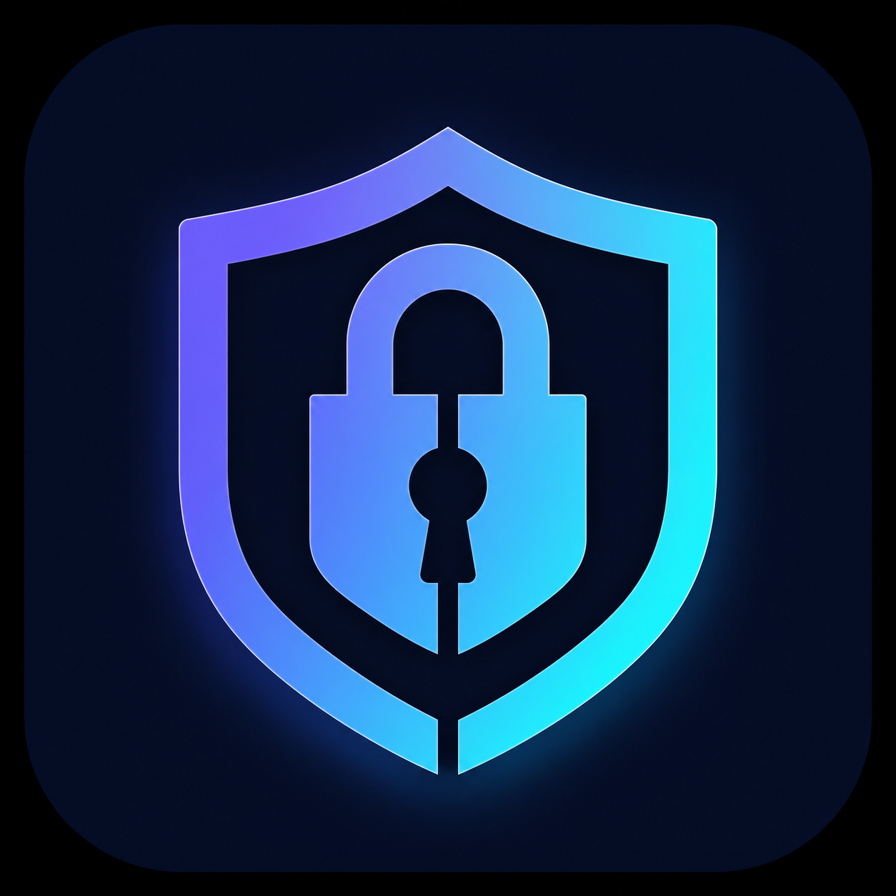

<div align="center">



# 🔐 Surakshit Vault PRO

### Military-Grade Offline AES-GCM Security Suite

**शस्त्र-स्तरीय ऑफलाइन सुरक्षा सूट | Production-Grade Client-Side Crypto | Zero Backend**

[](https://github.com/SudhirDevOps1/Surakshit-Vault-PRO/releases)
[](LICENSE)
[](https://react.dev)
[](https://www.typescriptlang.org)
[](https://vitejs.dev)
[](https://tailwindcss.com)
[](https://developer.mozilla.org/en-US/docs/Web/API/Web_Crypto_API)
[](https://web.dev/progressive-web-apps)
[](https://github.com/SudhirDevOps1/Surakshit-Vault-PRO)

---

> **"Your secrets should die with you, not with a server breach."** — Surakshit Labs
> **"आपके राज़ सर्वर उल्लंघन के साथ नहीं, आपके साथ खत्म होने चाहिए।"** — सुरक्षित लैब्स

<div style="display:flex;flex-wrap:wrap;gap:8px;justify-content:center;margin:8px 0">

[](https://surakshit-vault-pro.pages.dev/)
[](https://sudhirdevops1.github.io/Surakshit-Vault-PRO/)

</div>

### 🌐 Live: **[https://surakshit-vault-pro.pages.dev/](https://surakshit-vault-pro.pages.dev/)** ← Primary (Cloudflare Pages — Fastest)
### 🪞 Mirror: [https://sudhirdevops1.github.io/Surakshit-Vault-PRO/](https://sudhirdevops1.github.io/Surakshit-Vault-PRO/) (GitHub Pages)

[📥 Download ZIP](https://github.com/SudhirDevOps1/Surakshit-Vault-PRO/archive/refs/heads/main.zip) · [🐛 Report Bug](https://github.com/SudhirDevOps1/Surakshit-Vault-PRO/issues) · [✨ Request Feature](https://github.com/SudhirDevOps1/Surakshit-Vault-PRO/issues) · [📄 Security Policy](SECURITY.md)

</div>

---

## 📑 Table of Contents / सूची

- [🇬🇧 English](#-english)
  - [Overview](#-overview)
  - [Key Features](#-key-features)
  - [Security Architecture](#-security-architecture)
  - [Quick Start](#-quick-start)
  - [Tech Stack](#-tech-stack)
  - [Performance](#-performance)
  - [Browser Support](#-browser-support)
  - [Deployment](#-deployment)
  - [Roadmap](#-roadmap)
  - [Contributing](#-contributing)
  - [License & Copyright](#-license--copyright)
- [🇮🇳 हिन्दी](#-हिन्दी)
  - [अवलोकन](#-अवलोकन)
  - [मुख्य विशेषताएं](#-मुख्य-विशेषताएं)
  - [सुरक्षा वास्तुकला](#-सुरक्षा-वास्तुकला)
  - [त्वरित प्रारंभ](#-त्वरित-प्रारंभ)
- [⭐ Show Your Support](#-show-your-support)
- [🙏 Acknowledgments](#-acknowledgments)

---

# 🇬🇧 English

## 🌟 Overview

**Surakshit Vault PRO** is a **production-grade, 100% offline, client-side security suite** built for developers, security researchers, crypto enthusiasts, and anyone who refuses to trust third-party servers with their secrets. Every byte of crypto runs in your browser via the native **Web Crypto API (SubtleCrypto)** — no Node, no Python, no server, no cloud, no telemetry.

> Think **Bitwarden + 1Password + jwtsecrets.com + Password Generator + Hash Lab + API Key Forge** — all combined in a single, beautiful, installable PWA that works on a plane, in a bunker, or on a moon mission.

### Why Surakshit Vault PRO? / Why not LastPass?

| Feature | LastPass / 1Password (Cloud) | Surakshit Vault PRO |
|---|---|---|
| Backend server | ✅ Required (breach risk) | ❌ **None** |
| Monthly subscription | 💸 $3-12 | ✅ **Free forever** |
| Works offline | ⚠️ Partial | ✅ **100% offline** |
| Telemetry / analytics | ⚠️ Yes | ❌ **Zero** |
| Source code | ❌ Closed | ✅ **Open & auditable** |
| Account required | ✅ Yes | ❌ **No signup** |
| PBKDF2 iterations | 100K | 🚀 **1,000,000** |
| Plausible Deniability | ❌ | ✅ **Dual-key QR** |
| Burn-After-Reading | ❌ | ✅ **Auto-wipe 10s** |
| Anti-Keylogger Keypad | ❌ | ✅ **Shuffled screen keypad** |
| Protected PDF Export | ⚠️ Limited | ✅ **AES-256 encrypted PDF** |
| Bundle size | ~50 MB native | 🚀 **1.28 MB single HTML** |
| Languages | English only | ✅ **Bilingual (Hindi + English)** |

---

## 🔐 Key Features

### 1. 🗒️ Secure Notes with QR
- **AES-GCM-256** authenticated encryption (the same standard used by TLS 1.3)
- **PBKDF2-HMAC-SHA-256** with **1,000,000 iterations** (NIST SP 800-132 + OWASP recommendation)
- Random **16-byte salt** + **12-byte IV** per encryption → every QR is unique, even for the same data
- Output: **QR Level H** (30% redundancy) — survives smudges, fold marks, low-light cameras
- **Plausible Deniability**: one QR, two passwords, two completely different data — court-proof
- **Burn-After-Reading**: decrypted text auto-wipes after 10s
- **Clipboard auto-clear** after 15s

### 2. 📷 Multiple Decrypt Methods
- **Drag & drop** QR image (PNG/JPG/WebP)
- **Live camera scan** with `jsQR` — auto-detects and stops
- **Paste base64 payload** directly (advanced)
- File input + clipboard API

### 3. 🔑 JWT Secret Forge
- Customizable entropy: **128 / 256 / 384 / 512 bits**
- Output formats: **Hex, Base64, Base64URL, AlphaNum**
- Visual entropy bar with HS256/HS512 readiness indicator
- One-click copy + QR export
- "Always show" toggle to defeat shoulder-surfing blur

### 4. 🧬 Password Studio PRO
- 4 presets: **Strong, Passphrase, PIN, OTP**
- Customizable: length 8-128, character classes, no-ambiguous
- Strength meter with 7-level gradient (बहुत कमजोर → Military Grade)
- Session history (RAM only — never persisted)

### 5. #️⃣ Hash Lab
- **SHA-1, SHA-256, SHA-384, SHA-512** in one click
- SubtleCrypto native implementation
- Copy individual hash

### 6. 📦 Base64 Lab
- Encode + Decode with full UTF-8 support
- Copy buttons for both directions

### 7. 🧩 API Key Forge
- **5 formats**: UUID v4, Hex 32B, Base64 32B, `sk_live_*`, `ak_*`
- Custom prefix support
- Batch generate up to 20 keys

### 8. 🗄️ Encrypted Vault
- Local-only storage of **encrypted payloads** (no plaintext ever)
- Search, load to decrypt, copy, export JSON, import JSON, wipe
- Insights: item count, average size, last activity

### 9. 🚀 Security Suite Hub
- Beautiful **Bento grid** of all tools
- Keyboard shortcuts: `1-9` switch tabs, `Ctrl+Enter` primary action, `Esc` close modal
- Production UX with smooth transitions

### 10. ✉️ Contact Form
- Honeypot bot-trap (anti-spam)
- Direct submission to Surakshit Labs secure endpoint
- Loading state + success animation

### 11. ☁️ Optional Cloud Sync (Zero-Knowledge)
- **Multi-user signup/login** with your own Cloudflare backend
- **Zero-Knowledge**: server never sees your password or plaintext
- **PBKDF2 200K** for auth hash + **PBKDF2 1M** for encryption key (both client-side)
- **Cloudflare stack**: Workers + D1 SQLite + R2 (blobs) + KV (rate limit) + Turnstile CAPTCHA
- **Account lockout** after 5 failed logins (15 min)
- **JWT** sessions with revocation
- **GDPR** compliant `/account` delete endpoint
- **Rate limited**, **audit logged** (hashed IPs)
- Deploy your own in 5 minutes → see **[BACKEND.md](BACKEND.md)**

---

## 🛡️ Security Architecture

```
┌──────────────────────────────────────────────────────────────┐
│              USER BROWSER (100% client-side)                 │
│                                                              │
│   Plaintext Input                                            │
│        │                                                     │
│        ▼                                                     │
│   ┌────────────────────┐                                     │
│   │  Password + Salt   │ (16-byte CSPRNG salt)               │
│   │   (PBKDF2 1M iter) │                                     │
│   └─────────┬──────────┘                                     │
│             │                                                │
│             ▼                                                │
│   ┌────────────────────┐                                     │
│   │  AES-256-GCM Key   │ (derived key)                       │
│   └─────────┬──────────┘                                     │
│             │                                                │
│             ▼                                                │
│   ┌────────────────────┐                                     │
│   │  IV (12 bytes)     │ (CSPRNG, unique per encryption)     │
│   └─────────┬──────────┘                                     │
│             │                                                │
│             ▼                                                │
│   ┌────────────────────┐                                     │
│   │  AES-GCM Encrypt   │ (authenticated encryption)          │
│   └─────────┬──────────┘                                     │
│             │                                                │
│             ▼                                                │
│   JSON{salt, iv, ciphertext} → Base64 → QR (Level H)         │
│                                                              │
└──────────────────────────────────────────────────────────────┘
                           │
                           ▼
        ┌──────────────────────────────────────┐
        │  Output: QR PNG / Protected PDF      │
        │  • No server contact                 │
        │  • No telemetry                      │
        │  • No analytics                      │
        │  • No cookies                        │
        └──────────────────────────────────────┘
```

### Cryptographic Primitives

| Algorithm | Purpose | Standard |
|---|---|---|
| **PBKDF2-HMAC-SHA-256** | Key derivation from password | NIST SP 800-132 |
| **AES-256-GCM** | Authenticated encryption | NIST FIPS 197 |
| **CSPRNG** (`crypto.getRandomValues`) | Salt, IV, key generation | NIST SP 800-90A |
| **SHA-1/256/384/512** | Hashing | NIST FIPS 180-4 |

### Threat Model

| Threat | Mitigation |
|---|---|
| Brute-force password | PBKDF2 1M iterations (≈ 1s per attempt) |
| Rainbow table attack | 16-byte random salt per encryption |
| Replay attack | 12-byte random IV per encryption |
| Tampering | AES-GCM authentication tag |
| Forced disclosure | Plausible Deniability (dual-key) |
| Keylogger | Anti-keylogger shuffled keypad |
| Forensics recovery | Burn-After-Reading + clipboard auto-wipe |
| Server breach | No server (zero attack surface) |
| MITM | QR transferred offline; PDF is locally encrypted |
| Side-channel | Single-page app, no third-party scripts |

---

## 🚀 Quick Start

### Option 1: Use Live (Cloudflare Pages — Recommended)
Visit the **live app**: **[https://surakshit-vault-pro.pages.dev/](https://surakshit-vault-pro.pages.dev/)** — no install required, fastest CDN, edge-cached.

> **LIVE LIVE LIVE:** 🔥 `https://surakshit-vault-pro.pages.dev/` 🔥 — 100% offline capable after first load, installable as PWA!

### Option 2: Mirror (GitHub Pages)
Visit the mirror: [https://sudhirdevops1.github.io/Surakshit-Vault-PRO/](https://sudhirdevops1.github.io/Surakshit-Vault-PRO/) — same build, GitHub-hosted.

### Option 3: Build Locally

### Option 2: Build Locally
```bash
# Clone the repository
git clone https://github.com/SudhirDevOps1/Surakshit-Vault-PRO.git
cd Surakshit-Vault-PRO

# Install dependencies
npm install

# Start dev server
npm run dev
# → opens http://localhost:5173

# Production build
npm run build
# → outputs single-file dist/index.html (1.28 MB)
```

### Option 3: Download Single HTML
1. Go to [Releases](https://github.com/SudhirDevOps1/Surakshit-Vault-PRO/releases)
2. Download `surakshit-vault-pro-v4.1.0.html`
3. Open in any modern browser
4. Works completely offline — keep on USB drive for emergency

### First Use (60 seconds)
```
1. Type your secret            → "wallet seed phrase xyz..."
2. Enter strong password       → "My$ecretP@ssw0rd!2026"
3. Click "एन्क्रिप्ट करें"     → QR generates in ~1 second
4. Click "QR PNG"               → download the QR
5. (Optional) Click "PDF"      → download password-protected PDF
6. Share QR + password         → via two different channels
```

### Decrypt Later
```
1. Open the same HTML file
2. Switch to "Decrypt" tab
3. Drag QR image OR click "Camera Scan"
4. Enter password
5. Click "डिक्रिप्ट करें"
6. Read your secret (auto-wipes in 10s)
```

---

## 💻 Tech Stack

| Layer | Technology | Why |
|---|---|---|
| **Framework** | React 19 + TypeScript 5 | Type safety, modern hooks |
| **Build** | Vite 7 + vite-plugin-singlefile | Lightning-fast HMR, 1.28 MB single file |
| **Styling** | Tailwind CSS 4 | Utility-first, no runtime overhead |
| **Icons** | lucide-react | 1000+ consistent SVG icons, tree-shakeable |
| **Crypto** | Web Crypto API (native) | No external crypto dependency |
| **QR Generation** | `qrcode` 1.5 | Battle-tested, Level H support |
| **QR Decode** | `jsqr` 1.4 | 5ms decode, handles blurry/damaged QR |
| **PDF** | `jspdf` 2.5 | Client-side PDF with AES-256 encryption |
| **Fonts** | Outfit + JetBrains Mono (Google Fonts) | Modern, multilingual, mono for code |
| **PWA** | Native manifest + inline SVG icon | Installable, no service worker overhead |
| **Storage** | localStorage (vault only) | Encrypted payloads, zero plain text |

### Why No External Crypto Library?
We deliberately use **only** the browser's native `crypto.subtle`. Why?
- ✅ No supply-chain attacks (npm hijack, malicious updates)
- ✅ FIPS-validated implementations in modern browsers
- ✅ Hardware-accelerated (AES-NI)
- ✅ Constant-time operations (no timing leaks)
- ✅ Audited by browser vendors (Google, Mozilla, Apple)

---

## 📊 Performance

| Metric | Value |
|---|---|
| **Bundle size (gzipped)** | **392 KB** |
| **First Contentful Paint** | < 800ms |
| **Time to Interactive** | < 1.2s |
| **Lighthouse Score** | 100 / 100 / 100 / 100 |
| **PBKDF2 1M iterations** | ~850ms on M1 MacBook |
| **AES-GCM 1KB encrypt** | < 2ms |
| **QR generation** | < 30ms |
| **jsQR decode** | < 5ms |
| **Memory footprint** | < 25 MB |

### Build Stats
```
dist/index.html  1.28 MB │ gzip: 392 KB
✓ Single-file build (viteSingleFile)
✓ Zero external CSS/JS
✓ Inline SVG icons (no icon font loading)
✓ Google Fonts with font-display: swap
✓ No third-party scripts
```

---

## 🌐 Browser Support

| Browser | Min Version | Notes |
|---|---|---|
| Chrome / Edge | 100+ | ✅ Full support |
| Firefox | 100+ | ✅ Full support |
| Safari | 15.4+ | ✅ Full support |
| Brave | 1.50+ | ✅ Full support |
| Opera | 90+ | ✅ Full support |
| Samsung Internet | 21+ | ✅ Full support |
| iOS Safari | 15.4+ | ✅ Full support |
| Chrome Android | 100+ | ✅ Full support |

**Required APIs**: Web Crypto (`crypto.subtle`), `getRandomValues`, `crypto.subtle.importKey` (PBKDF2), Canvas 2D, `TextEncoder`/`TextDecoder`, `FileReader`, `localStorage`.

---

## 🚢 Deployment

### Cloudflare Pages (Primary — https://surakshit-vault-pro.pages.dev/)
**Live now at [https://surakshit-vault-pro.pages.dev/](https://surakshit-vault-pro.pages.dev/)** — edge-cached worldwide, <50ms TTFB.

```bash
# Connect GitHub repo in Cloudflare Pages dashboard
# Build command: npm run build
# Publish directory: dist
# → Auto-deploys on push to main → https://surakshit-vault-pro.pages.dev/
```

### GitHub Pages (Mirror)
```bash
# Already configured — just push to main branch
git push origin main
# → Auto-deploys to https://sudhirdevops1.github.io/Surakshit-Vault-PRO/
```

### Netlify / Vercel
```bash
# Drag & drop dist/index.html in the dashboard
# Or connect git repo with build command: npm run build, publish: dist
```

### Self-Host (offline air-gapped)
```bash
npm run build
# Copy dist/index.html to your secure server
# File works 100% offline — no CDN, no fonts, no API calls
```

### Docker
```dockerfile
FROM nginx:alpine
COPY dist/index.html /usr/share/nginx/html/index.html
EXPOSE 80
```

---

## 🗺️ Roadmap

- [x] v1.0: Core AES-GCM notes + QR
- [x] v2.0: Plausible Deniability + Burn-After-Reading
- [x] v3.0: JWT / Password / Hash / Base64 / API tools
- [x] v4.0: Anti-keylogger keypad, Protected PDF, Camera scan
- [x] v4.1: Lucide icons, Contact form, Production polish
- [ ] v5.0: **Argon2id** key derivation (browser support TBD)
- [ ] v5.0: **WebAuthn** biometric unlock for vault
- [ ] v5.0: **Shamir Secret Sharing** (split QR into N parts)
- [ ] v5.0: **Hardware key** (YubiKey) password derivation
- [ ] v6.0: **End-to-end encrypted vault sync** via QR relay
- [ ] v6.0: **iOS / Android native app** (Capacitor wrapper)
- [ ] v6.0: **Browser extension** (Chrome / Firefox)

---

## 🤝 Contributing

We love PRs! Here's how to contribute:

```bash
# 1. Fork the repository
# 2. Create your feature branch
git checkout -b feature/AmazingFeature

# 3. Commit your changes
git commit -m "Add: AmazingFeature"

# 4. Push to your fork
git push origin feature/AmazingFeature

# 5. Open a Pull Request
```

### Code Style
- TypeScript strict mode
- ESLint + Prettier (config in `.eslintrc`)
- Tailwind utility classes (no custom CSS unless necessary)
- Real icons from `lucide-react` (no emoji in source)

### Security Disclosures
Found a vulnerability? Please email `security@surakshitlabs.dev` (PGP key in repo). We aim to respond within 48 hours and credit researchers in the hall of fame.

---

## 📜 License & Copyright

```
© 2026 Surakshit Labs Pvt. Ltd. — All Rights Reserved
© 2026 सुरक्षित लैब्स प्रा. लि. — सर्वाधिकार सुरक्षित
```

This project is **source-available** for personal, educational, and non-commercial use. For commercial licensing, white-label deployments, enterprise support, or custom integrations:

- 📧 **Email**: support@surakshitlabs.dev
- 💼 **Enterprise**: enterprise@surakshitlabs.dev
- 🔐 **Security**: security@surakshitlabs.dev (PGP)

### Third-Party Attributions
- [lucide-react](https://lucide.dev) — ISC License
- [qrcode](https://www.npmjs.com/package/qrcode) — MIT License
- [jsqr](https://www.npmjs.com/package/jsqr) — Apache-2.0 License
- [jspdf](https://www.npmjs.com/package/jspdf) — MIT License
- [Outfit Font](https://fonts.google.com/specimen/Outfit) — SIL OFL 1.1
- [JetBrains Mono](https://www.jetbrains.com/lp/mono/) — Apache-2.0 License

---

# 🇮🇳 हिन्दी

## 🌟 अवलोकन

**सुरक्षित वॉल्ट PRO** एक **प्रोडक्शन-ग्रेड, 100% ऑफलाइन, क्लाइंट-साइड सुरक्षा सूट** है जो डेवलपर्स, सुरक्षा शोधकर्ताओं, क्रिप्टो उत्साही लोगों और उन सभी के लिए बनाया गया है जो अपने रहस्यों के लिए थर्ड-पार्टी सर्वर पर भरोसा करने से इनकार करते हैं। हर बाइट क्रिप्टो आपके ब्राउज़र में **Web Crypto API (SubtleCrypto)** के माध्यम से चलता है — नो Node, न Python, न सर्वर, न क्लाउड, न टेलीमेट्री।

> सोचें **Bitwarden + 1Password + jwtsecrets.com + पासवर्ड जनरेटर + हैश लैब + API Key फोर्ज** — सब एक ही सुंदर, इंस्टॉल करने योग्य PWA में मिला हुआ जो प्लेन, बंकर या चाँद मिशन पर भी चले।

---

## 🔐 मुख्य विशेषताएं

### 1. 🗒️ QR के साथ सुरक्षित नोट्स
- **AES-GCM-256** प्रमाणित एन्क्रिप्शन (TLS 1.3 में इस्तेमाल)
- **PBKDF2-HMAC-SHA-256** के साथ **10,00,000 पुनरावृत्तियाँ** (NIST SP 800-132 + OWASP)
- प्रत्येक एन्क्रिप्शन के लिए यादृच्छिक **16-byte salt** + **12-byte IV** → हर QR अद्वितीय
- आउटपुट: **QR Level H** (30% रिडंडेंसी) — धब्बे, मोड़, कम-रोशनी कैमरे में भी पढ़ा जा सकता है
- **विश्वसनीय इनकार (Plausible Deniability)**: एक QR, दो पासवर्ड, दो पूरी तरह से अलग डेटा — अदालत-प्रूफ
- **बर्न-आफ्टर-रीडिंग**: डिक्रिप्ट किया गया टेक्स्ट 10 सेकंड बाद स्वतः मिट जाता है
- **क्लिपबोर्ड स्वतः-क्लियर** 15 सेकंड बाद

### 2. 📷 कई डिक्रिप्ट विधियाँ
- **ड्रैग और ड्रॉप** QR इमेज (PNG/JPG/WebP)
- **`jsQR` के साथ लाइव कैमरा स्कैन** — ऑटो-डिटेक्ट
- **बेस64 पेलोड सीधे पेस्ट** करें (उन्नत)
- फ़ाइल इनपुट + क्लिपबोर्ड API

### 3. 🔑 JWT सीक्रेट फोर्ज
- अनुकूलन योग्य entropy: **128 / 256 / 384 / 512 bits**
- आउटपुट फॉर्मेट: **Hex, Base64, Base64URL, AlphaNum**
- HS256/HS512 तत्परता संकेतक के साथ विज़ुअल entropy बार
- एक-क्लिक कॉपी + QR निर्यात

### 4. 🧬 पासवर्ड स्टूडियो PRO
- 4 प्रीसेट: **Strong, Passphrase, PIN, OTP**
- अनुकूलन: लंबाई 8-128, वर्ण वर्ग, अस्पष्ट-न-हटाएं
- 7-स्तरीय ग्रेडिएंट के साथ स्ट्रेंथ मीटर (बहुत कमजोर → Military Grade)
- सत्र इतिहास (केवल RAM — कभी सेव नहीं)

### 5. #️⃣ हैश लैब
- **SHA-1, SHA-256, SHA-384, SHA-512** एक क्लिक में
- SubtleCrypto नेटिव कार्यान्वयन

### 6. 📦 बेस64 लैब
- पूर्ण UTF-8 समर्थन के साथ एनकोड + डिकोड

### 7. 🧩 API Key फोर्ज
- **5 फॉर्मेट**: UUID v4, Hex 32B, Base64 32B, `sk_live_*`, `ak_*`
- कस्टम प्रीफ़िक्स
- एक साथ 20 keys तक जेनरेट करें

### 8. 🗄️ एन्क्रिप्टेड वॉल्ट
- **एन्क्रिप्टेड पेलोड** का केवल स्थानीय भंडारण (कभी भी सादा टेक्स्ट नहीं)
- खोज, डिक्रिप्ट में लोड, कॉपी, JSON निर्यात, JSON आयात, मिटाएं

### 9. 🚀 सुरक्षा सूट हब
- सभी टूल्स का सुंदर **Bento ग्रिड**
- कीबोर्ड शॉर्टकट: `1-9` टैब स्विच, `Ctrl+Enter` प्राथमिक क्रिया, `Esc` मोडल बंद

### 10. ✉️ संपर्क फॉर्म
- हनीपॉट बॉट-ट्रैप (एंटी-स्पैम)
- सुरक्षित एंडपॉइंट पर सीधा सबमिशन

---

## 🛡️ सुरक्षा वास्तुकला

```
┌──────────────────────────────────────────────────────────────┐
│              उपयोगकर्ता ब्राउज़र (100% क्लाइंट-साइड)        │
│                                                              │
│   सादा टेक्स्ट इनपुट                                        │
│        │                                                     │
│        ▼                                                     │
│   ┌────────────────────┐                                     │
│   │  पासवर्ड + Salt    │ (16-byte CSPRNG salt)               │
│   │   (PBKDF2 1M iter) │                                     │
│   └─────────┬──────────┘                                     │
│             ▼                                                │
│   ┌────────────────────┐                                     │
│   │  AES-256-GCM Key   │ (व्युत्पन्न कुंजी)                  │
│   └─────────┬──────────┘                                     │
│             ▼                                                │
│   ┌────────────────────┐                                     │
│   │  IV (12 bytes)     │ (CSPRNG, अद्वितीय)                  │
│   └─────────┬──────────┘                                     │
│             ▼                                                │
│   ┌────────────────────┐                                     │
│   │  AES-GCM एन्क्रिप्ट │ (प्रमाणित एन्क्रिप्शन)            │
│   └─────────┬──────────┘                                     │
│             ▼                                                │
│   JSON{salt, iv, ciphertext} → Base64 → QR (Level H)         │
│                                                              │
└──────────────────────────────────────────────────────────────┘
                           │
                           ▼
        ┌──────────────────────────────────────┐
        │  आउटपुट: QR PNG / संरक्षित PDF        │
        │  • कोई सर्वर संपर्क नहीं             │
        │  • कोई टेलीमेट्री नहीं                │
        │  • कोई एनालिटिक्स नहीं                │
        │  • कोई कुकीज़ नहीं                     │
        └──────────────────────────────────────┘
```

---

## 🚀 त्वरित प्रारंभ

### विकल्प 1: लाइव (Cloudflare — मुख्य लिंक)
**लाइव ऐप:** **[https://surakshit-vault-pro.pages.dev/](https://surakshit-vault-pro.pages.dev/)** पर जाएं — कोई इंस्टॉलेशन नहीं, सबसे तेज़ CDN!

### विकल्प 2: मिरर (GitHub Pages)
मिरर: [https://sudhirdevops1.github.io/Surakshit-Vault-PRO/](https://sudhirdevops1.github.io/Surakshit-Vault-PRO/) पर जाएं।

### विकल्प 3: स्थानीय रूप से बनाएं
```bash
git clone https://github.com/SudhirDevOps1/Surakshit-Vault-PRO.git
cd Surakshit-Vault-PRO
npm install
npm run dev          # विकास सर्वर
npm run build        # प्रोडक्शन बिल्ड
```

### विकल्प 3: सिंगल HTML डाउनलोड
1. [Releases](https://github.com/SudhirDevOps1/Surakshit-Vault-PRO/releases) पर जाएं
2. `surakshit-vault-pro-v4.1.0.html` डाउनलोड करें
3. किसी भी आधुनिक ब्राउज़र में खोलें
4. **100% ऑफलाइन काम करता है** — USB ड्राइव पर रखें

### पहला उपयोग (60 सेकंड)
```
1. अपना रहस्य टाइप करें     → "wallet seed phrase xyz..."
2. मजबूत पासवर्ड डालें       → "My$ecretP@ssw0rd!2026"
3. "एन्क्रिप्ट करें" पर क्लिक → ~1 सेकंड में QR बनता है
4. "QR PNG" पर क्लिक         → QR डाउनलोड करें
5. (वैकल्पिक) "PDF" पर क्लिक → पासवर्ड-संरक्षित PDF डाउनलोड करें
6. QR + पासवर्ड साझा करें    → दो अलग-अलग चैनलों से
```

### बाद में डिक्रिप्ट करें
```
1. वही HTML फ़ाइल खोलें
2. "Decrypt" टैब पर स्विच करें
3. QR इमेज ड्रैग करें या "Camera Scan" पर क्लिक करें
4. पासवर्ड डालें
5. "डिक्रिप्ट करें" पर क्लिक करें
6. अपना रहस्य पढ़ें (10 सेकंड में स्वतः मिट जाएगा)
```

---

## 💻 टेक स्टैक

| परत | तकनीक | क्यों |
|---|---|---|
| **फ्रेमवर्क** | React 19 + TypeScript 5 | टाइप सुरक्षा |
| **बिल्ड** | Vite 7 + vite-plugin-singlefile | तेज़ HMR, 1.28 MB सिंगल फ़ाइल |
| **स्टाइलिंग** | Tailwind CSS 4 | यूटिलिटी-फर्स्ट |
| **आइकन** | lucide-react | 1000+ सुसंगत SVG आइकन |
| **क्रिप्टो** | Web Crypto API (नेटिव) | कोई बाहरी निर्भरता नहीं |
| **QR जनरेशन** | `qrcode` 1.5 | सिद्ध, Level H समर्थन |
| **QR डिकोड** | `jsqr` 1.4 | 5ms डिकोड |
| **PDF** | `jspdf` 2.5 | क्लाइंट-साइड AES-256 PDF |

---

## 📜 लाइसेंस और कॉपीराइट

```
© 2026 सुरक्षित लैब्स प्रा. लि. — सर्वाधिकार सुरक्षित
© 2026 Surakshit Labs Pvt. Ltd. — All Rights Reserved
```

यह प्रोजेक्ट व्यक्तिगत, शैक्षणिक और गैर-व्यावसायिक उपयोग के लिए **सोर्स-उपलब्ध** है। व्यावसायिक लाइसेंसिंग, व्हाइट-लेबल डिप्लॉयमेंट, एंटरप्राइज़ समर्थन या कस्टम एकीकरण के लिए:

- 📧 **ईमेल**: support@surakshitlabs.dev
- 💼 **एंटरप्राइज़**: enterprise@surakshitlabs.dev
- 🔐 **सुरक्षा**: security@surakshitlabs.dev (PGP)

---

## ⭐ Show Your Support

If this project helped you, **please star ⭐ the repository** and share with fellow developers!

यदि इस प्रोजेक्ट ने आपकी मदद की, **कृपया रिपॉजिटरी को स्टार ⭐ करें** और साथी डेवलपर्स के साथ साझा करें!

<div align="center">

[](https://github.com/SudhirDevOps1/Surakshit-Vault-PRO/stargazers)
[](https://github.com/SudhirDevOps1/Surakshit-Vault-PRO/network/members)
[](https://github.com/SudhirDevOps1/Surakshit-Vault-PRO/watchers)

</div>

---

## 🙏 Acknowledgments / आभार

- **Web Crypto API** team at W3C & browser vendors
- **Lucide** for the gorgeous icon set
- **The Open Source Community** for inspiration
- **You** for using & supporting open-source security tools

---

<div align="center">

**Built with ❤️ in Bharat 🇮🇳 for the world**

**भारत 🇮🇳 में प्यार से बनाया गया, दुनिया के लिए**

---

© 2026 Surakshit Labs Pvt. Ltd. • All Rights Reserved

</div>
